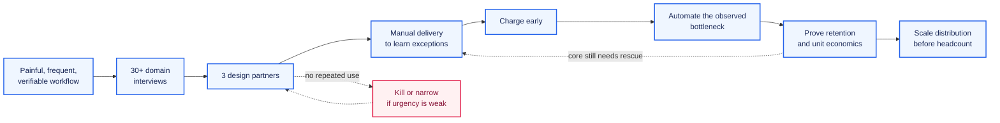

# 15-month roadmap: own an end-to-end outcome

## Target state

By month 15, be able to show one case where you:

- discovered a costly problem with users or stakeholders;
- measured the existing process;
- designed architecture and evaluations;
- deployed to production;
- earned sustained adoption;
- improved a business metric;
- operated incidents;
- migrated a model or provider without uncontrolled regression.

This is the common trunk for a staff-level engineer and a technical founder.

## Learn

### Socio-technical system design

- Map the full workflow, incentives and exception paths.
- Place approvals where they reduce expected loss, not everywhere.
- Prevent humans from becoming a disguised labeling queue.
- Run discovery interviews and write concise decision memos.
- Measure retention and trust, not only model accuracy.

### AI economics

- Cost per correct and useful result.
- Build versus buy and concentration risk.
- Unit economics, pricing and support burden.
- Causal or quasi-causal impact measurement when simple before/after is misleading.

### Adaptable architecture

- Provider interfaces and outcome-level regression suites.
- Data retention, privacy and audit rules.
- Versioning for prompts, tools, schemas, policies and evals.
- Concurrent execution with clear task ownership.

## Build: common trunk

Extend the real workflow until it has:

- outcome dashboards and SLOs;
- an eval set sampled from production;
- controlled rollout and rollback;
- explicit error-cost tiers;
- a documented incident process;
- unit economics;
- a migration exercise to a second model/provider.

## Engineer path

Choose work where the role owns production and adoption, not only model integration. Strong environments provide:

- direct access to customers or operators;
- accountability for an outcome metric;
- authority to change the workflow;
- meaningful data and production volume;
- serious reliability and security standards.

Aim to become the person who can take a question such as "halve this operating cycle without increasing risk" from discovery through rollout.

## Founder path

PNG export

Do not start with "agents for X". Start with expensive, frequent and verifiable work made newly tractable by agents.

1. Conduct at least 30 domain interviews.
2. Secure three design partners before building a general platform.
3. Perform unreliable parts manually while learning exceptions.
4. Charge early enough to test urgency.
5. Automate the observed bottleneck.
6. Keep the team minimal until the acquisition channel is understood.

Agents lower the cost of experiments. They do not remove sales, support, compliance or trust.

## Avoid

- Internal eval gains that do not correlate with user outcomes.
- Permanent human babysitting hidden behind "autonomy".
- Headcount for code production before product and distribution are proven.
- Dependence on temporary model arbitrage.
- Pilot enthusiasm confused with retained use.
- Expanding horizontally before one workflow is deep and reliable.

## Exit criteria

### Common

- At least 20 active users, or 80% adoption of the intended internal population.
- Three months of cohort retention.
- A meaningful economic result: e.g. 2x ROI, 50% less human time, higher revenue or avoided losses.
- Visible SLOs, cost per result, escalation rate and critical defects.
- One controlled provider/model migration.
- Important incidents become regression tests within 48 hours.

### Engineer path

- Explicit roadmap and outcome ownership.
- At least one executive decision changed by your technical/economic analysis.
- Other engineers use the evaluation or operations system you created.
- Your throughput rises without review queue age or defect escape rising proportionally.

### Founder path

- Five to ten paying customers, or three contracts with weekly use and expansion.
- Support cost and contribution margin measured.
- The next bottleneck is increasingly distribution or domain coverage, not rescuing core reliability.
- Manual service work is visible and declining per customer.
