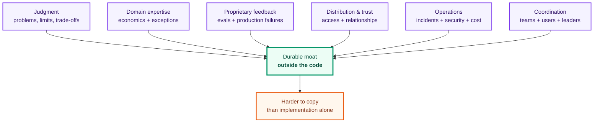
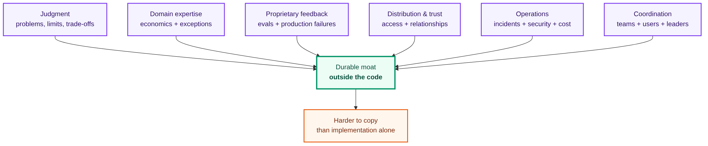

# 36-month roadmap: build a moat outside the code

## Premise

At 36 months, predicting tools or model names is not useful. Under continued progress, most well-specified implementation becomes cheaper and more delegable. A durable strategy must survive even if that happens earlier than expected.

## The personal moat

PNG export

"Knowing how to use agents" will not be scarce. A defensible profile compounds six assets:

1. **Judgment:** a record of choosing good problems, limits and trade-offs.
2. **Domain expertise:** understanding economics and exceptions that generic demos miss.
3. **Proprietary feedback:** production failures, evaluations and behavior data.
4. **Distribution and trust:** access to important workflows and decision-makers.
5. **Operational experience:** incidents, security, cost and provider changes.
6. **Coordination:** changing how technical teams, users and leaders work together.

Code helps create these assets. It is rarely the strongest asset itself.

## Engineer path

Target responsibility for a business capability augmented by agents, not expertise in one framework.

A strong principal/staff/technical-lead scope includes:

- ownership of a portfolio of systems or customer outcomes;
- authority over architecture, evals and rollout;
- direct contact with operators and leadership;
- a small team whose implementation capacity is amplified by agents;
- an audited record of economic impact and reliability.

The engineer's job is to increase organizational decision and delivery bandwidth without increasing hidden risk.

## Founder path

A small company can generate the software output of a much larger team. That does not guarantee a small company can sell, support and govern it.

A defensible 3-8 person company combines:

- a deeply embedded workflow;
- feedback data that improves decisions;
- permissions and trust that take time to earn;
- domain-specific distribution;
- superior evaluation and operations;
- switching costs created by delivered value, not hostage data.

Hire earlier for domain, distribution, customer success or risk than for extra coding capacity, unless deep infrastructure, security or proprietary models are the product.

## Learn

- Strategy and organizational design under high technical leverage.
- Hiring people with ownership and domain depth.
- Enterprise sales or product-led distribution, depending on the wedge.
- Regulation and expected-loss reasoning in the chosen domain.
- Capital allocation across a portfolio of experiments.
- Agent governance: authority, auditability and responsibility.

## Build

- A production-derived corpus of evals and failures.
- A minimal internal platform for specification, execution, verification and observability. Add an abstraction only after three real uses.
- An incident-learning system where important failures update tests and policy.
- Public technical artifacts: benchmarks, sanitized postmortems and evidence-backed design decisions.
- A repeatable channel for learning from and reaching users.

## Avoid

- Tying identity to a title, tool or provider.
- Scaling headcount as a proxy for progress.
- Horizontal expansion before mastering one workflow.
- Accepting opacity because the next model may be better.
- Letting generation exceed the ability to verify and operate.
- Building a proprietary layer that disappears when a base model improves.

## Exit criteria

### Common

- Three end-to-end cases with verified economics, adoption and reliability.
- At least 5x validated value per human hour versus the starting baseline, without a proportional increase in incidents.
- More than 80% of routine implementable work delegated; human time concentrates on product, architecture, evals, incidents and relationships.
- A private evaluation corpus that predicts production better than public benchmarks.
- At least one public artifact that third parties use, cite or reproduce.

### Engineer path

- Principal/staff-equivalent scope in practice.
- Ownership of metric and budget.
- Ability to multiply a team without becoming its review bottleneck.
- Succession: another engineer can operate the system without tacit rescue work.

### Founder path

- Healthy retention and unit economics.
- Growth not dependent on hidden manual service.
- A small team unless a measured constraint justifies expansion.
- Material advantage from domain feedback, workflow, distribution or trust rather than prompts.
